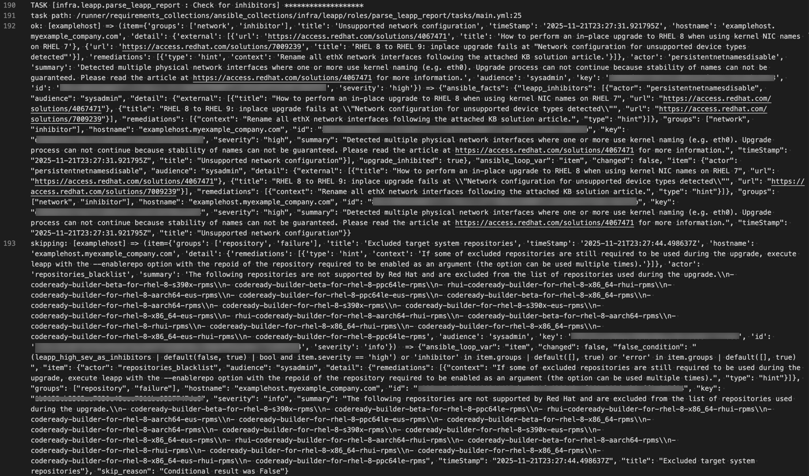
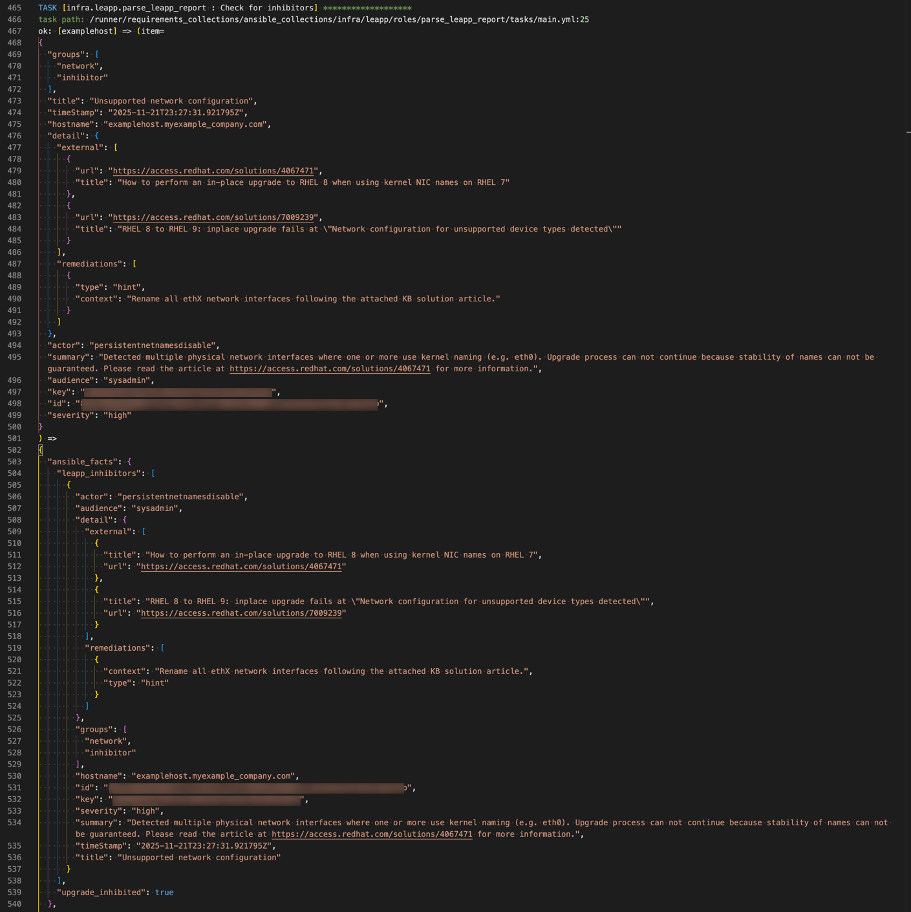

# Ansible Output Formatter

[](https://marketplace.visualstudio.com/items?itemName=gearboxscott.ansible-output-formatter)
[](https://marketplace.visualstudio.com/items?itemName=gearboxscott.ansible-output-formatter)
[](https://marketplace.visualstudio.com/items?itemName=gearboxscott.ansible-output-formatter)

Format and syntax highlight Ansible Automation Platform job output for easier debugging and analysis.

## Features

- 🎨 **Syntax Highlighting** - Colors TASK headers, status messages, JSON keys/values, and more
- 📝 **Format JSON Output** - Automatically formats embedded JSON structures
- 🔄 **Python Dict Conversion** - Converts Python dictionary notation to properly formatted JSON
- 📦 **Collapsible Sections** - Makes JSON blocks collapsible for easier navigation
- ✨ **Handle Escape Sequences** - Properly converts `\n` and other escape sequences
- 🚀 **One-Click Formatting** - Format and highlight with a single keyboard shortcut

## Screenshots

### Before


### After


## Installation

### From VSCode Marketplace (Recommended)

1. Open VSCode
2. Press `Ctrl+Shift+X` (Windows/Linux) or `Cmd+Shift+X` (Mac)
3. Search for "Ansible Output Formatter"
4. Click Install

### From VSIX File

Download the `.vsix` file from [Releases](https://github.com/gearboxscott/ansible-output-formatter/releases) and install via:
```bash
code --install-extension ansible-output-formatter-1.0.2.vsix
```

## Usage

### Quick Start

1. Open your Ansible job output file (`.txt` or rename to `.ansible-output`)
2. Press `Cmd+Shift+F` (Mac) or `Ctrl+Shift+F` (Windows/Linux)
3. ✨ Done! Your output is formatted and highlighted

### Alternative Methods

**Via Command Palette:**
1. Press `Cmd+Shift+P` (Mac) or `Ctrl+Shift+P` (Windows/Linux)
2. Type "Format and Highlight Ansible Output"
3. Press Enter

**Via Right-Click Menu:**
1. Right-click anywhere in your file
2. Select "Format and Highlight Ansible Output"

## Commands

All commands are available via the Command Palette (`Cmd+Shift+P` / `Ctrl+Shift+P`):

| Command | Description |
|---------|-------------|
| `Format and Highlight Ansible Output` | Formats JSON and applies syntax highlighting (recommended) |
| `Format Ansible Output` | Only formats the JSON without changing syntax highlighting |
| `Set Language to Ansible Output` | Only applies syntax highlighting without formatting |

## Keyboard Shortcuts

| Shortcut | Action |
|----------|--------|
| `Cmd+Shift+F` (Mac)<br>`Ctrl+Shift+F` (Windows/Linux) | Format and Highlight Ansible Output |

## Syntax Highlighting Features

The extension highlights:

- ✅ **TASK/PLAY headers** - Bold, distinctive colors for easy scanning
- ✅ **Status keywords** - `ok`, `changed`, `failed`, `skipping`, `fatal`, `ignored`
- ✅ **Hostnames** - Colored brackets like `[hostname]`
- ✅ **JSON keys** - Property names in distinct colors
- ✅ **JSON values** - Strings, numbers, booleans, and null values
- ✅ **Task paths** - File paths with line numbers
- ✅ **Ansible keywords** - `ansible_facts`, `item`, `msg`, `changed`, etc.

## Supported File Types

- Ansible Automation Platform 2.x job output
- Red Hat Ansible Tower job output
- AWX job output
- Any text file with Ansible playbook output

## Requirements

- Visual Studio Code 1.80.0 or higher

## Extension Settings

This extension works out of the box with no configuration required.

## Known Issues

- Very large output files (>10MB) may take a few seconds to format
- The extension must be manually triggered for `.txt` files (VSCode reserves `.txt` for plain text)

For more issues, see [GitHub Issues](https://github.com/gearboxscott/ansible-output-formatter/issues)

## Release Notes

[Release Notes](https://github.com/gearboxscott/ansible-output-formatter/CHANGELOG.md)

## Contributing

Contributions are welcome! Please feel free to submit a Pull Request.

1. Fork the repository
2. Create your feature branch (`git checkout -b feature/AmazingFeature`)
3. Commit your changes (`git commit -m 'Add some AmazingFeature'`)
4. Push to the branch (`git push origin feature/AmazingFeature`)
5. Open a Pull Request

## Support

- 📧 [Report an Issue](https://github.com/gearboxscott/ansible-output-formatter/issues)
- 💬 [Discussions](https://github.com/gearboxscott/ansible-output-formatter/discussions)
- ⭐ [Star on GitHub](https://github.com/gearboxscott/ansible-output-formatter)

## License

This extension is licensed under the [MIT License](LICENSE).

## Author

**Scott Parker**

- GitHub: [@gearboxscott](https://github.com/gearboxscott)

## Acknowledgments

- Built for the Ansible and DevOps community
- Inspired by daily debugging needs with Ansible Automation Platform

---

**Enjoy easier Ansible debugging!** ⚡

If this extension helped you, please consider:
- ⭐ Starring the [GitHub repository](https://github.com/gearboxscott/ansible-output-formatter)
- ✍️ Leaving a review on the [VSCode Marketplace](https://marketplace.visualstudio.com/items?itemName=gearboxscott.ansible-output-formatter)
- 🐛 Reporting issues to help improve the extension
